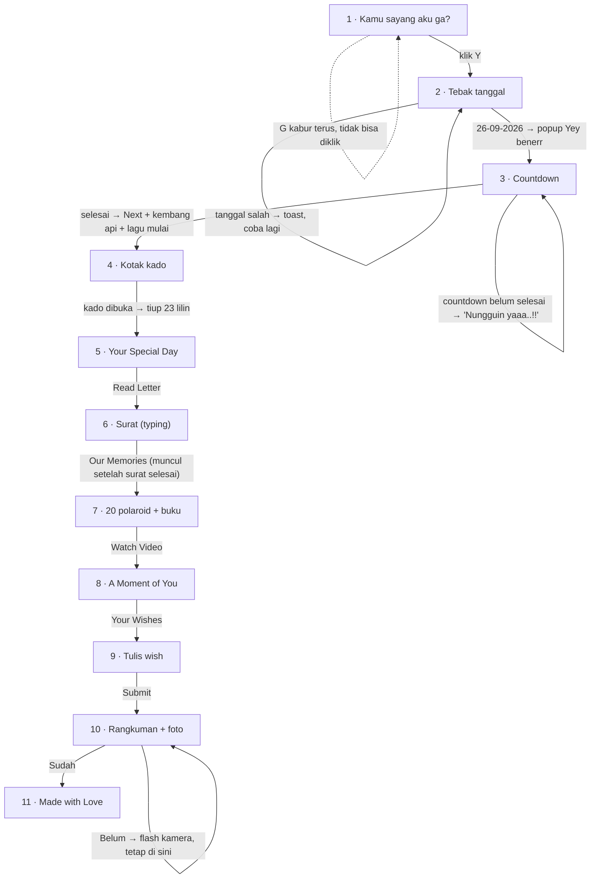

# Detail Page: "For Vina 💌"

Website hadiah ulang tahun ke-23 untuk **Vina Ayu Miranda** (26 September 2026).
User story: **"kelucuan dan keindahan"**, dibalut warna **pink × biru ala Stitch**.

> Semua teks, path foto, surat, dan quotes ada di satu file: [src/config/content.js](src/config/content.js).
> Improvisasi di luar brief ada di [docs/improvisasi.md](docs/improvisasi.md) (dan toggle-nya di [src/config/improvisations.js](src/config/improvisations.js)).

---

## 0. Alur besar



| # | Halaman | Masuk dengan transisi | Keluar lewat |
|---|---|---|---|
| 1 | Pertanyaan "Kamu sayang aku ga?" | fade + blur | Hati pink raksasa menutup layar |
| 2 | Tebak tanggal | hati pink membuka | Hati biru-pink raksasa |
| 3 | Countdown | hati biru membuka | Kembang api + kilatan putih |
| 4 | Kotak kado → kue 23 lilin | kilatan putih | Kembang api + kilatan putih |
| 5 | Your Special Day | kilatan putih | fade + blur (default) |
| 6 | Surat | kertas "turun" 3D | default |
| 7 | Our Sweet Memories | default | default |
| 8 | A Moment of You | default | default |
| 9 | Wishes | default | Kertas terbang ke bintang, lalu hati pink |
| 10 | Rangkuman | hati pink membuka | Hati pink |
| 11 | Made with Love | background berubah jadi langit malam | (akhir) |

---

## Elemen global (ada di semua halaman)

```
┌──────────────────────────────────────────────┐
│ ☁︎        ♡         ✦             ♡           │  ← Background: gradasi pink→biru,
│      ♡          ☁︎            ✦                │    awan melayang, hati naik pelan,
│  ✦        [ KONTEN HALAMAN ]        ♡         │    kilau berkelip (CSS, ringan di HP)
│     ♡               ✦           ☁︎             │
└──────────────────────────────────────────────┘
  lapisan atas: kanvas kembang api · confetti hati · toast · transisi hati
```

| Elemen | Keterangan | File |
|---|---|---|
| Background | Siang (page 1–10), berganti **langit malam** + kelopak jatuh di page 11 | [Background.jsx](src/components/Background.jsx) |
| Transisi antar-page | Hati raksasa (pink/biru) atau kilatan putih | [ScreenWipe.jsx](src/components/ScreenWipe.jsx) |
| Animasi masuk/keluar page | fade + scale + blur | [PageShell.jsx](src/components/PageShell.jsx) |
| Kembang api | Canvas; ±40% ledakan berbentuk **hati** | [FireworksCanvas.jsx](src/components/FireworksCanvas.jsx) |
| Confetti hati | `canvas-confetti` bentuk hati | [fx.js](src/lib/fx.js) |
| Musik "Westlife – My Love" | Mulai di tombol **Next** page 3, `loop` tanpa batas sampai tab ditutup | [MusicContext.jsx](src/context/MusicContext.jsx) |
| Maskot | Alien imut bergaya Stitch (SVG orisinal, biru & pink, 7 ekspresi) | [Mascot.jsx](src/components/Mascot.jsx) |
| Font | Pacifico (judul imut), Dancing Script (teks), Great Vibes (judul romantis), Quicksand (label kecil) | [index.html](index.html) |

**Tentang musik:**
- Browser melarang audio berbunyi otomatis tanpa klik, jadi lagu dimulai tepat saat Vina mengklik **Next** di page 3.
- Kalau halaman ter-refresh di page 4 ke atas, lagu otomatis lanjut lagi di sentuhan/klik pertama.
- Di page 8, lagu **dikecilkan lalu di-pause selama video diputar**, lalu lanjut lagi saat video di-pause atau selesai. Tanpa ini, suara lagu dan video akan tabrakan.

---

## Page 1: "Kamu sayang aku ga?"

**File:** [src/pages/P01Question.jsx](src/pages/P01Question.jsx)

### Wireframe (HP 390px)
```
┌──────────────────────────┐
│                          │
│        (maskot pink)(maskot biru)
│   ┌────────────────────┐ │
│   │ ✦               ♡  │ │
│   │                    │ │
│   │ Kamu sayang aku ga?│ │   ← Pacifico, navy
│   │                    │ │
│   │   [  Y  ]  [  G  ] │ │   ← Y pink, G biru
│   │                    │ │
│   └────────────────────┘ │
│                  [ G ]   │   ← G setelah kabur (posisi acak di layar)
└──────────────────────────┘
```

### Wireframe (Desktop)
```
┌───────────────────────────────────────────────────────────┐
│  ☁︎                                              ♡         │
│                     (pink)(biru)                          │
│              ┌──────────────────────────┐        [ G ]    │
│              │   Kamu sayang aku ga?    │                 │
│              │     [  Y  ]   [ ░░░ ]    │  ← slot G kosong │
│              └──────────────────────────┘    setelah kabur │
│   [ G ]?                                                  │
└───────────────────────────────────────────────────────────┘
```

### Interaksi
| Aksi | Hasil |
|---|---|
| Kursor mendekati **G** (±40px) | G **kabur** ke posisi acak di layar (jauh dari kursor, minimal 150px dari posisi lama), dengan animasi pegas + goyang. **Tidak ada batas**: G kabur selamanya. |
| Tap **G** di HP | G langsung pindah saat jari menyentuh, jadi klik tidak pernah terjadi |
| Tab/Enter ke G (keyboard) | G juga kabur |
| Klik **Y** | Confetti hati dari tombol Y → hati pink raksasa menutup layar → Page 2 |

### Animasi
- Kartu pop-up masuk dengan pegas (scale 0.4 → 1, sedikit berputar).
- Maskot pink goyang (bob) & biru melayang. Ekspresi berubah setelah G pertama kali kabur (pink melet 😛, biru kaget 😮).
- Ikon kilau & hati berdetak di pojok kartu.

### Improvisasi (AKTIF, disetujui)
`p1Teasing`: tombol Y **makin besar** tiap G kabur (maks. ±1.8×) dan bergeser mulus ke tengah kartu, plus balon ejekan kecil di dekat G ("wlee 😝", "yakin mau G?", "Y aja sayang 🥺", …).
```
│                 ╭──────────────╮
│                 │Y aja sayang 🥺│
│                 ╰──────────────╯
│                    [ G ]         ← G kabur ke pojok
│   ┌────────────────────┐
│   │ Kamu sayang aku ga?│
│   │     [   Y   ]      │         ← Y membesar & di tengah
│   └────────────────────┘
```

---

## Page 2: Tebak Tanggal

**File:** [src/pages/P02Date.jsx](src/pages/P02Date.jsx)

### Wireframe (HP)
```
┌──────────────────────────┐
│        (maskot biru ^^)  │
│  Yeay, kamu sayang aku   │  ← Pacifico, gradasi pink→ungu→biru
│      yh, boong ye?       │
│ ✦ Sekarang tanggal berapa│  ← Dancing Script
│        sayang? ✦         │
│ ┌──────────┐┌──────────┐ │
│ │04-04-2027││03-04-2025│ │  ← 6 tombol, grid 2 kolom (desktop 3 kolom)
│ └──────────┘└──────────┘ │    border selang-seling pink/biru
│ ┌──────────┐┌──────────┐ │
│ │26-09-2024││17-06-2025│ │
│ └──────────┘└──────────┘ │
│ ┌──────────┐┌──────────┐ │
│ │20-07-2026││26-09-2026│ │  ← posisi jawaban benar diacak
│ └──────────┘└──────────┘ │
└──────────────────────────┘
```

### Toast salah (di atas layar)
```
        ╭──────────────────────────────────╮
        │  Salah, wlee 😜❤️, Coba lagi!     │  ← pill pink, bounce dari atas, 2.4 detik
        ╰──────────────────────────────────╯
```

### Pop-up benar
```
┌──────────────────────────┐
│    (maskot pink 😍)       │
│ ┌──────────────────────┐ │
│ │   Yey, benerr 😘❤️    │ │  ← modal, backdrop blur
│ │      ♡  ♡  ♡         │ │
│ └──────────────────────┘ │
└──────────────────────────┘
```

### Interaksi
| Aksi | Hasil |
|---|---|
| Klik tanggal salah | Tombol **goyang** (shake) + toast "Salah, wlee 😜❤️, Coba lagi!" |
| Klik **26-09-2026** | Pop-up "Yey, benerr 😘❤️" + confetti hati → 2.3 detik → hati biru raksasa → Page 3 |

- 5 tanggal lain **acak** (tahun 2021–2029, format DD-MM-YYYY, tidak kembar), diacak ulang setiap page dibuka.
- Tombol muncul satu per satu (stagger pop).

---

## Page 3: Countdown

**File:** [src/pages/P03Countdown.jsx](src/pages/P03Countdown.jsx)

### Wireframe (HP)
```
┌──────────────────────────┐
│   ⏰ Counting Day         │  ← jam weker: jarum berputar + goyang
│ ✿ Her Special Day ✿      │  ← Great Vibes besar, bunga mekar & berputar
│        is Coming         │
│ Something special and    │
│ magic will happen to your│
│ life, be ready sayang!   │
│ ┌────┐┌────┐┌────┐┌────┐ │
│ │ 01 ││ 01 ││ 36 ││ 27 │ │  ← angka "jatuh" tiap berganti
│ │DAY ││HOUR││MIN.││SEC.│ │    kotak pink/biru selang-seling
│ └────┘└────┘└────┘└────┘ │
│                          │
│  (maskot) Nungguin yaaa..!!   ← SELAMA countdown belum selesai
└──────────────────────────┘
```

### Saat countdown selesai (00:00:00:00)
```
│ ┌────┐┌────┐┌────┐┌────┐ │
│ │ 00 ││ 00 ││ 00 ││ 00 │ │     🎆  kembang api 6 detik
│ └────┘└────┘└────┘└────┘ │   🎇   + confetti dari kiri-kanan
│        [ Next ♡ ]        │  ← menggantikan "Nungguin yaaa..!!"
```

### Interaksi
| Kondisi / Aksi | Hasil |
|---|---|
| Sebelum 26 Sep 2026 00:00 WIB | Tampil "Nungguin yaaa..!!" (tombol Next tidak ada) |
| Countdown menyentuh 0 | Kembang api + confetti, tombol **Next** muncul dengan pegas |
| Klik **Next** | Kembang api lagi + confetti hati + **lagu My Love mulai (loop tanpa batas)** → 2.8 detik → kilatan putih → Page 4 |

- Target: `2026-09-26T00:00:00+07:00` (WIB), bisa diubah di `BIRTHDAY_TARGET`.
- Label persis: **Day · Hour · Minutes · Second**.
- Untuk testing ada 2 cara:
  - `isCountdown = false` di [content.js](src/config/content.js): countdown mati, page 3 langsung dalam kondisi selesai (00:00:00:00, kembang api, tombol Next). **Kembalikan ke `true` sebelum dikirim ke Vina.**
  - `?page=3&preview=1`: countdown tetap jalan, tapi selesai 8 detik lagi (untuk melihat momen pergantian dari "Nungguin yaaa..!!" ke tombol Next).

---

## Page 4: Kotak Kado

**File:** [src/pages/P04Gift.jsx](src/pages/P04Gift.jsx)

### Wireframe (sebelum dibuka)
```
┌──────────────────────────┐
│                          │
│    ✦        ⋈  (pita)    │
│         ┌─────────┐      │  ← tutup kado (pink muda, pita biru)
│         ├────┃────┤      │
│      ✦  │ ∘ ∘┃∘ ∘ │  ✦   │  ← badan kado pink polkadot, pita biru
│         │ ∘ ∘┃∘ ∘ │      │    goyang-goyang tiap ±2.6 detik
│         └────┸────┘      │
│   ♡ Klik kadonya ya sayang 🎁   ← teks naik-turun
└──────────────────────────┘
```

### Wireframe (setelah diklik)
```
┌──────────────────────────┐
│    \  \  |  /  /         │  ← sinar emas berputar
│   ──  (maskot 😍)  ──     │  ← maskot biru meloncat keluar
│    /  ┌────┃────┐  \     │     tutup kado terlempar ke kanan atas
│       │ ∘ ∘┃∘ ∘ │         │  ♡ ♡ confetti hati + bintang
│       └────┸────┘         │
│      Surprise!! 🎉        │
└──────────────────────────┘
```

### Urutan animasi saat diklik
1. 0–0.75 dtk: kado **gemetar** makin kencang (goyang + membesar).
2. 0.75 dtk: tutup **terlempar** (naik, berputar, menghilang), sinar emas muncul, confetti hati + bintang.
3. ±1 dtk: maskot **meloncat keluar** (pegas), teks "Surprise!! 🎉".
4. 3.3 dtk: kado mengecil & menghilang, lalu **kue 23 lilin** muncul (lihat di bawah).

### Kue 23 lilin (improvisasi `p4Cake`, AKTIF)
```
┌──────────────────────────┐
│ Make a wish dulu, sayang 🤫✨
│ Terus tiup lilinnya, tap kuenya ya 🎂
│      ıııııııııııı        │  ← 23 lilin pink/biru, api bergoyang
│     ╭─ıııııııııı─╮       │     (12 baris belakang, 11 depan)
│     │  biru ∘ ∘  │       │
│  (pink)╭──────────╮(biru)│  ← maskot di kiri-kanan kue
│    │   pink  ∘ ∘   │     │
│    ╰───────────────╯     │
│  🕯️ 23 lilin masih menyala│  ← hitungan sisa lilin
└──────────────────────────┘
```

| Aksi | Hasil |
|---|---|
| Tap kue | "fuuuh~ 🌬️" muncul di titik tap, **6–8 lilin padam** dengan asap kecil naik |
| Tap lagi (±3–4 kali total) | Sisa lilin padam, hitungan berkurang |
| Semua lilin padam | "Yeay!! Wish-nya pasti terkabul ✨", maskot tertawa, confetti hati + kembang api → 3.6 dtk → kilatan putih → Page 5 |

---

## Page 5: Your Special Day

**File:** [src/pages/P05Special.jsx](src/pages/P05Special.jsx)

### Wireframe (Desktop)
```
┌───────────────────────────────────────────────────────────┐
│  ┌─────┐                                        ┌─────┐   │
│  │foto1│                  ✿ ♡ ✿                 │foto4│   │
│  └─────┘              Your Special Day          └─────┘   │
│     ┌─────┐          (Great Vibes, pink)     ┌─────┐      │
│     │foto2│   ✦ Created by your Engineer love, │foto5│      │
│     └─────┘     Alif Virdio Yudhistira Widyawan └─────┘    │
│  ┌─────┐              [ ✉ Read Letter ]         ┌─────┐   │
│  │foto3│                                        │foto6│   │
│  └─────┘                                        └─────┘   │
└───────────────────────────────────────────────────────────┘
   3 polaroid kiri                              3 polaroid kanan
```

### Wireframe (HP)
```
┌──────────────────────────┐
│ ┌────┐  ┌────┐  ┌────┐   │  ← 3 polaroid (kiri) jadi baris atas
│ │ 1  │  │ 2  │  │ 3  │   │
│ └────┘  └────┘  └────┘   │
│         ✿ ♡ ✿            │
│    Your Special Day      │
│ Created by your Engineer │
│ love, Alif Virdio …      │
│    [ ✉ Read Letter ]     │
│ ┌────┐  ┌────┐  ┌────┐   │  ← 3 polaroid (kanan) jadi baris bawah
│ │ 4  │  │ 5  │  │ 6  │   │
│ └────┘  └────┘  └────┘   │
└──────────────────────────┘
```

### Animasi
- Polaroid masuk dari samping (stagger), lalu masing-masing **goyang & melayang dengan ritme berbeda** (6 pola gerak).
- Hover polaroid: membesar & lurus.
- Tiap polaroid ada selotip washi pink/biru.
- Klik **Read Letter** → Page 6.

---

## Page 6: Surat

**File:** [src/pages/P06Letter.jsx](src/pages/P06Letter.jsx) · Isi surat: `LETTER` di [content.js](src/config/content.js)

### Wireframe
```
┌──────────────────────────────────┐
│(♡)▰▰▰                    ▰▰▰     │  ← segel hati + 2 selotip washi
│ ┌──────────────────────────────┐ │
│ │ ┃ Dear Vina Ayu Miranda,     │ │  ← kertas bergaris + margin pink
│ │─┃────────────────────────────│ │
│ │ ┃ Selamat ulang tahun yang   │ │  ← teks MENGETIK kiri → kanan,
│ │─┃────────────────────────────│ │    per huruf, pelan
│ │ ┃ ke-23, cantikku. 🎂💕       │ │
│ │─┃────────────────────────────│ │
│ │ ┃ Hari ini aku mau bilang s▌ │ │  ← kursor berkedip
│ │─┃────────────────────────────│ │
│ │ ┃                          ▒ │ │  ← area bisa di-scroll
│ └──────────────────────────────┘ │
│                     (maskot pink)│
│                                  │
│        [ Our Memories ♡ ]        │  ← MUNCUL SETELAH mengetik selesai
└──────────────────────────────────┘
```

### Perilaku
- Kecepatan: `LETTER_TYPING_SPEED = 45` ms/huruf, dengan jeda lebih lama setelah titik (×8), koma (×4), dan baris baru (×10), supaya terasa seperti ditulis sungguhan. Surat template ±1.400 huruf ≈ 1,5 menit.
- Selama mengetik, kertas **otomatis scroll mengikuti baris terbaru**. Kalau Vina scroll ke atas untuk membaca ulang, auto-scroll berhenti sampai dia kembali ke bawah.
- Setelah selesai: surat **tetap bisa di-scroll** untuk dibaca ulang, dan tombol **Our Memories** muncul.
- Emoji di surat tidak pernah tampil "setengah" (dipecah per grapheme).

---

## Page 7: Our Sweet Memories

**File:** [src/pages/P07Memories.jsx](src/pages/P07Memories.jsx) · Buku: [src/components/FlipBook.jsx](src/components/FlipBook.jsx)

### Wireframe (Desktop, halaman panjang)
```
┌───────────────────────────────────────────────────────────┐
│ ♡✿        Our Sweet Memories, Sayang!             ✿♡      │  ← hati berdetak, bunga berputar
│            ✦ 6 years and still counting . . .             │  ← titik berkedip bergantian
│                                                           │
│  ┌────┐  ┌────┐  ┌────┐  ┌────┐  ┌────┐                   │
│  │ 1  │  │ 2  │  │ 3  │  │ 4  │  │ 5  │   ← 20 polaroid,   │
│  └────┘  └────┘  └────┘  └────┘  └────┘     miring acak,   │
│  ┌────┐  ┌────┐  ┌────┐  ┌────┐  ┌────┐     goyang tipis   │
│  │ 6  │  │ 7  │  │ 8  │  │ 9  │  │ 10 │                    │
│  └────┘  └────┘  └────┘  └────┘  └────┘   grid: HP 2 kolom,│
│   …                                …      tablet 3-4,      │
│  ┌────┐  ┌────┐  ┌────┐  ┌────┐  ┌────┐   desktop 5        │
│  │ 16 │  │ 17 │  │ 18 │  │ 19 │  │ 20 │                    │
│  └────┘  └────┘  └────┘  └────┘  └────┘                    │
│                                                           │
│          ♡ Ada buku kecil buat kita, buka yuk 📖          │
│                  ┌────────────┐                           │
│                  │ ♡          │ ← sampul biru              │
│                  │Our Little  │   "tap to open"            │
│                  │ Love Book  │                            │
│                  │Vina ♡ Alif │                            │
│                  └────────────┘                           │
│                  ( ‹ )  cover  ( › )                       │
│                                                           │
│                  [ ▶ Watch Video ]                         │
└───────────────────────────────────────────────────────────┘
```

### Buku setelah dibuka
```
            ┌─────────────┬─────────────┐
            │  ┌───────┐  │  ┌───────┐  │   ← 2 foto per halaman terbuka
            │  │foto 1 │  │  │foto 2 │  │     (kiri & kanan)
            │  └───────┘  │  └───────┘  │
            │ chapter one │the beginning│
            │      1      │      2      │
            └─────────────┴─────────────┘
                   ( ‹ )   1 / 6   ( › )
   halaman terakhir: "and our story goes on…" (maskot berdua) | "to be continued, forever ♡"
```

### Interaksi
| Aksi | Hasil |
|---|---|
| Hover polaroid (desktop) | Polaroid terangkat, lurus, membesar + **bunga, kilau & hati kecil bermunculan** di sekelilingnya |
| Tap polaroid (HP) | Efek bunga yang sama selama ±1.8 detik |
| Scroll | Tiap polaroid "jatuh" ke tempatnya saat masuk layar |
| Klik sampul / halaman kanan / swipe kiri / tombol › | Halaman **membalik 3D** ke depan |
| Klik halaman kiri / swipe kanan / tombol ‹ | Balik ke belakang |
| Klik **Watch Video** | Page 8 |

### Improvisasi (AKTIF, disetujui)
`p7Lightbox`: tap/klik polaroid → foto tampil besar di tengah layar (latar diburamkan). Tap di mana saja untuk menutup. Efek bunga tetap muncul.

---

## Page 8: A Moment of You

**File:** [src/pages/P08Video.jsx](src/pages/P08Video.jsx)

### Wireframe
```
┌──────────────────────────────────┐
│     ✦  A Moment of You  ✦        │  ← Great Vibes besar
│             ▰▰▰▰                 │  ← selotip
│ ♡ ┌────────────────────────────┐ │
│   │                            │ │
│   │          ╭─────╮           │ │  ← tombol play berbentuk HATI
│   │          │  ▶  │ ((( )))   │ │    + gelombang denyut
│   │          ╰─────╯           │ │
│   │      tap buat play ♡       │ │
│   └────────────────────────────┘ │ ♡
│                                  │
│        [ Your Wishes ✦ ]         │
└──────────────────────────────────┘
```

### Perilaku
- Sebelum diputar: cover (poster opsional) + tombol play hati. Setelah diputar, kontrol video bawaan muncul (pause, seek, fullscreen).
- Rasio video bisa diatur (`16 / 9` atau `9 / 16` untuk video vertikal dari HP).
- Selama video diputar, lagu latar dikecilkan lalu di-pause, dan lanjut lagi setelahnya.
- Kalau file video belum ada, tampil maskot + "Videonya nanti muncul di sini ya 🎬".

---

## Page 9: Wish Vina ✨ (improvisasi, sesuai permintaanmu)

**File:** [src/pages/P09Wishes.jsx](src/pages/P09Wishes.jsx)

### Wireframe
```
┌──────────────────────────────────┐
│ ♡ Halo sayang, tadi kan udah wish│
│  dari aku yaa, sekarang aku mau  │  ← teks pembuka (sesuai brief)
│  kamu tulis isi hatimu apa aja,… │
│                                  │
│  (maskot mengintip) ╭───────────╮│
│   /\  ◕ ◕  /\      │Tulis yang ││  ← balon kata maskot
│      (tangan)(tangan)banyak yaa~││
│ ┌──────────────────────────────┐ │
│ │ My wishes at 23 ✨         ✦ │ │  ← kertas buku tulis
│ │- - - - - - - - - - - - - - - │ │
│ │ ┃ Tulis di sini ya sayang…   │ │  ← textarea bergaris
│ │─┃────────────────────────────│ │
│ │ ┃                            │ │
│ └──────────────────────────────┘ │
│                                  │
│           [ Submit ✦ ]           │
└──────────────────────────────────┘
```

### Improvisasi yang aktif (9.1–9.4, 9.6, 9.7 disetujui)
| Ide | Detail |
|---|---|
| **Kertas buku tulis** | Kertas bergaris dengan margin pink + judul "My wishes at 23 ✨" |
| **Maskot mengintip** | Maskot biru mengintip dari balik kertas, tangannya "memegang" tepi kertas |
| **"Aku ga ngintip kok 🙈"** | Saat Vina mengetik, maskot **menutup mata dengan kedua tangan** |
| **Balon kata yang berubah** | Kosong: "Tulis yang banyak yaa sayang~ 💕" · mengetik: "Aku ga ngintip kok 🙈" · sudah terisi: "Udah? Pencet Submit yaa ✨" · submit kosong: "Isi dulu dong sayang 🥺" (+ tombol goyang) |
| **Wish terbang ke bintang** | Setelah Submit, kertas mengecil & melayang ke atas, bintang besar muncul: "Wish kamu lagi terbang ke bintang… ✨" + confetti hati, lalu Page 10 |
| **Draft aman** | Tulisan tersimpan di browser, jadi tidak hilang kalau halaman ter-refresh |

> Chip inspirasi (9.5) **dihapus** karena tidak disetujui.

### Soal "wish tersimpan di aku (Alif) tanpa Vina tahu"
**Tidak diimplementasikan.** Wish hanya disimpan di browser perangkat yang dipakai Vina (localStorage), supaya bisa ditampilkan di page 10.

---

## Page 10: Rangkuman ✨ (improvisasi, sesuai permintaanmu)

**File:** [src/pages/P10Summary.jsx](src/pages/P10Summary.jsx)

### Wireframe (HP)
```
┌──────────────────────────┐
│  Happy Birthday, Sayang! │  ← gradasi candy
│  Vina Ayu Miranda · 23 ✨ │
│┌ - - - - - - - - - - - - ┐│  ← bingkai putus-putus (area "difoto")
│ ┌─SEP─┐♡        (2)(3)   │  ← kalender membalik 1→26, balon "2" "3"
│ │ 26  │           | |     │
│ │2003 │                   │
│ └─────┘ hari kamu lahir ♡ │
│   ♛                       │  ← mahkota
│ ┌──┐┌──────────┐┌──┐      │  ← 2 polaroid samping miring
│ │  ││  FOTO    ││  │ ♡    │  ← polaroid utama + stiker
│ │  ││  VINA    │[birthday girl ♡]
│ └──┘│          │└──┘      │
│(maskot)└──────────┘  ♡ ♡ ♡ │  ← hati-hati naik dari belakang foto
│ ┌──────────────────────┐  │
│ │Wish kamu di umur 23 💌│  │  ← wish dari page 9
│ │"Semoga di umur 23 …" │  │
│ │    — Vina, 26.09.2026│  │
│ └──────────────────────┘  │
│ ┌──┬──┬──┐ vina·23        │  ← photo strip ala photobooth (3 foto)
│ └──┴──┴──┘                │
│└ - - - - - - - - - - - - ┘│
│ Difoto dulu sayang, ini   │
│ lucuu bangett lochh! ❤️    │
│  [ Buka Photobooth 📸 ]    │  ← photobooth kamera
│       Sudah foto?         │
│   [ Sudah ]  [ Belum 📸 ]  │
└──────────────────────────┘
```

### Wireframe (Desktop)
```
┌──────────────────────────────────────────────────────────────┐
│                  Happy Birthday, Sayang!                     │
│                 Vina Ayu Miranda · 23 ✨                      │
│ (2)(3)┌ - - - - - - - - - - - - - - - - - - - - - - - - - ┐  │
│       ┌─SEP─┐ ♡          ♛                 ┌──────────────┐  │
│       │ 26  │     ┌──┐┌─────────┐┌──┐     │Wish kamu … 💌│  │
│       └─────┘     │  ││  FOTO   ││  │     │"…………………"     │  │
│    hari kamu lahir│  ││  VINA   ││  │     │  — Vina      │  │
│       ┌───┐       └──┘└─────────┘└──┘     └──────────────┘  │
│       │ 4 │     (maskot)  [birthday girl]                    │
│       │ 5 │  ← photo strip vertikal                          │
│       │ 6 │                                                  │
│       └ - - - - - - - - - - - - - - - - - - - - - - - - - ┘  │
│           Difoto dulu sayang, ini lucuu bangett lochh! ❤️     │
│                   [ Buka Photobooth 📸 ]                      │
│                        Sudah foto?                           │
│                   [ Sudah ]  [ Belum 📸 ]                     │
└──────────────────────────────────────────────────────────────┘
```

### Improvisasi yang aktif
| Ide | Detail |
|---|---|
| Judul **Happy Birthday, Sayang!** + nama & umur | Pembuka halaman rangkuman |
| **Kalender hidup** | Tanggal membalik cepat 1 → 26 lalu berhenti, hati berdetak muncul, kalender bergoyang pelan. Menampilkan **26 SEP 2003** (tanggal lahir) |
| **Balon "2" & "3"** | Melayang naik-turun |
| **Tumpukan polaroid** | Foto utama + 2 foto samping miring yang bergoyang |
| **Stiker overlay** di foto utama | Mahkota, kilau, hati, label "birthday girl ♡", maskot bermata hati |
| **Hati naik** dari belakang foto | Seperti gelembung cinta yang terus mengalir |
| **Photo strip** 3 foto ala photobooth | Horizontal di HP, vertikal di desktop |
| **Kartu wish** | Wish dari page 9 + tanda tangan "— Vina, 26.09.2026" |
| Confetti saat halaman terbuka | Hati + confetti dari kiri-kanan |
| **Belum** → efek kamera | Kilatan putih seperti flash kamera + toast "Cekrek! 📸 Difoto dulu yaa sayang, aku tungguin 🥰", tetap di page 10 |
| **Sudah** → | Confetti hati + transisi hati → Page 11 |

### Photobooth kamera (improvisasi `p10Photobooth`, AKTIF)
```
┌────────────────────────────┐
│  Photobooth Vina 📸     (×) │
│ ┌────────────────────────┐ │
│ │♛                    ♡  │ │  ← bingkai pink-biru + stiker
│ │ ┌────────────────────┐ │ │
│ │ │                    │ │ │
│ │ │  KAMERA DEPAN      │ │ │  ← live, mirror (seperti cermin)
│ │ │  (live)       3…   │ │ │  ← hitung mundur 3-2-1 saat Cekrek
│ │ │                    │ │ │
│ │(pink) [birthday girl ♡](biru)
│ │ Happy Birthday, Sayang!│ │
│ │ Vina · 23 · 26.09.2026 │ │
│ └────────────────────────┘ │
│       [ Cekrek! 📸 ]        │
│  Senyum yang lucu yaa sayang~
└────────────────────────────┘
setelah foto: [ Simpan foto 💾 ]  [ Foto lagi ]
```

| Aksi | Hasil |
|---|---|
| Buka Photobooth | Browser minta izin kamera → preview live dengan bingkai & stiker (maskot berkedip & telinga bergoyang) |
| Cekrek! | Hitung mundur 3-2-1 → flash putih → foto jadi 1080×1350 (4:5), **persis seperti preview** |
| Simpan foto | HP: menu Bagikan bawaan (pilih "Simpan Gambar"). Laptop: file `photobooth-vina-23.jpg` terunduh. Setelah itu muncul toast "Fotonya udah kesimpen, lucu bangett! 🥰" |
| Foto lagi | Kembali ke kamera live |
| Tutup (×) | Kamera langsung dimatikan |
| Izin kamera ditolak | Maskot + pesan "Kameranya belum diizinkan 🥺 …" + tombol **Coba lagi** |

Foto diproses sepenuhnya di HP Vina dan tidak diunggah ke mana pun.

---

## Page 11: Made with Love (penutup)

**File:** [src/pages/P11Closing.jsx](src/pages/P11Closing.jsx) · Quotes: `CLOSING_QUOTES` di [content.js](src/config/content.js)

### Wireframe
```
┌──────────────────────────────────┐
│ ·   ✦    ·   (langit malam)  ·   │  ← background berganti: navy → ungu,
│        ·     ♥ (berdetak)    ·   │    bintang berkelip, kelopak jatuh
│      Made with Love              │  ← Great Vibes, putih bercahaya pink
│ from : Alif Virdio Yudhistira    │
│          Widyawan                │
│                                  │
│  ✦ "Of all the places I have …"  │  ← quotes muncul SATU PER SATU
│  ✦ "Twenty-three looks …"        │    (jeda 1.5 detik, fade + blur)
│  ✦ "You are the calm in …"       │
│  ✦ "Thank you for choosing …"    │
│  ✦ "Here's to every sunrise …"   │
│                                  │
│        (maskot pink)(maskot biru)│
└──────────────────────────────────┘
```

- Quotes di `CLOSING_QUOTES` masih **placeholder**; ganti dengan kalimatmu (jumlah bebas).
- Lagu tetap berputar (loop) sampai website ditutup.

### Improvisasi (AKTIF, disetujui)
`p11ReplayButton`: tombol kecil "Ulang dari awal ↺" muncul di bawah setelah semua quotes tampil → kembali ke Page 1 (lagu tetap berputar).

---

## Lampiran: struktur file

```
ultah-sayang/
├── detail-page.md            ← dokumen ini
├── README.md                 ← cara menjalankan & deploy singkat
├── docs/
│   ├── improvisasi.md        ← daftar improvisasi + status
│   ├── design-system.md      ← warna, font, komponen, animasi
│   ├── aset-dan-konten.md    ← nama & ukuran foto/lagu/video
│   └── deploy-vercel.md      ← langkah deploy
├── public/
│   ├── audio/my-love.mp3     ← (kamu tambahkan)
│   ├── video/a-moment-of-you.mp4
│   └── photos/{special,memories,book,her}/NN.jpg
└── src/
    ├── config/content.js         ← SEMUA teks, foto, surat, quotes
    ├── config/improvisations.js  ← toggle improvisasi
    ├── pages/P01…P11             ← 1 file per halaman
    ├── components/               ← Mascot, Polaroid, FlipBook, dll.
    ├── context/                  ← musik & toast
    ├── hooks/                    ← countdown, typewriter
    └── lib/                      ← efek, storage, parameter URL
```
